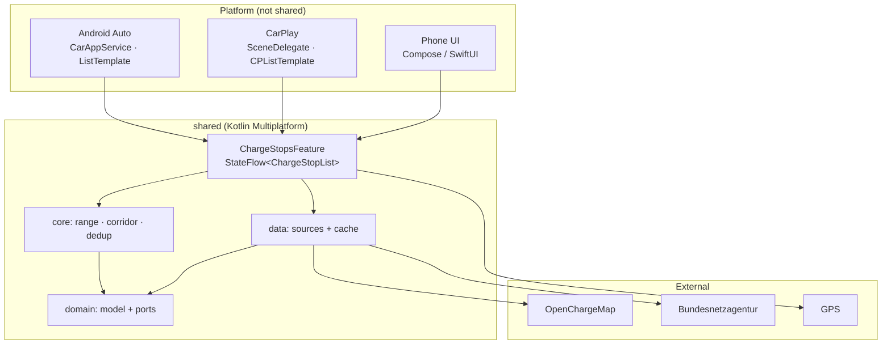

# autoapp — Architecture

**Charging-stop assistant for Android Auto and Apple CarPlay.**
Shows the next reachable charging stations ahead while driving, sorted by
distance, filtered by vehicle and desired charging networks, with a
reachability rating based on the remaining range.

As of: 2026-09-03 · Status: M1 complete and verified against the real OCM interface

---

## 1. Platform realities (before anything gets built)

Four constraints shape the entire design. They aren't design decisions but
limitations of the target platforms.

### 1.1 The active navigation route can't be read

Neither Android Auto nor CarPlay give a third-party app access to the
running route from Google Maps or Apple Maps. There's no API for it, and
that's by design.

**Consequence:** "charging stations on the route" has to be produced some
other way. Two approaches:

| Approach | How | Effort |
|---|---|---|
| **Corridor** (M1) | Current position + heading → search sector ahead | low, no backend |
| **Real route** (moved up) | Own destination entry + routing engine → buffer along polyline | medium |

Both sit behind the same port, `RouteProvider`. The UI and the reachability
logic don't see the difference.

**The real route was moved up**, because the corridor misses reality —
measured against the charging-station registry for the same trip,
Nuremberg–Munich:

| Search area | Charging facilities |
|---|---|
| Sector ±35°, 175 km | 33,508 |
| Route, 25 km buffer | 7,855 |
| Route, 5 km buffer | 2,932 |
| **Route, 2 km buffer** | **769** |

Factor 44 versus the hand-drawn line; with the real OSRM route it's 1,584
instead of 33,508, so factor 21 — the difference is the urban areas at the
start and destination that a real route passes through. In both cases it
stays at **a single query** instead of seventeen.

And the number is only half the justification: the sector mostly contains
charging stations nobody would actually drive to — village chargers
perpendicular to the direction of travel. The corridor remains as the
**fallback** when no destination is set.

Implemented: the destination and destination history live in the
`SettingsStore`, the route is computed **once per destination** and trimmed
at the front only as the drive progresses. In the car, the destination can
be switched from the history — a text field is something the Car App
Library deliberately doesn't offer.

The price is **double destination entry**: because the route running in
Maps can't be read, the driver has to enter the destination once there and
once here. There's no way around that; it's the same reason the corridor
existed in the first place.

### 1.2 The charge level can't be read reliably on any platform

- **Android Auto (projected):** `androidx.car.app.hardware.info.EnergyLevel`
  and `EvStatus` exist in the library but are only populated if the head
  unit supplies the data. In projection, very few do. Additionally required:
  permission `com.google.android.gms.permission.CAR_FUEL`. Every value
  arrives as a `CarValue` with a `StatusCode` — `STATUS_UNIMPLEMENTED` is
  the normal case, not the exception.
- **Android Automotive OS:** there the `CarPropertyManager` delivers real
  values. A different target platform, not part of this project (but the
  `SoCSource` port is open for it).
- **CarPlay / iOS:** there is **no** API for vehicle data. Period.

**Made verifiable:** whether the head unit exposes the data can only be
determined *in* the car — there's no `CarContext` on the phone. The car
session therefore persists its result into settings (`SoCDiagnostics`), and
the phone UI displays it: available, no value (with a status code),
permission missing, or no CarHardware. Without this display it would stay
unexplained to the driver why their input applies sometimes and sometimes
doesn't.

The `CAR_FUEL` permission is **not** requested at startup, only on the
car's charge-level screen. Vehicle data is an opportunistic upgrade;
demanding an unneeded permission unprompted at startup is the surest way to
get it denied.

**Consequence:** Manual SoC entry is the only basis that works on both
platforms, and thus the default. `CarHardwareSoCSource` (Android) runs as an
opportunistic upgrade alongside it: if it delivers a value, that value wins;
otherwise the manual one applies. OEM cloud connectors (Smartcar/Enode) are,
later, just another `SoCSource` without changing anything else.

### 1.3 Android Auto: category POI, not CHARGING

`androidx.car.app.category.CHARGING` and `.PARKING` have been **deprecated
since Car App Library 1.3**. The app declares:

```xml
<service android:name=".car.ChargeCarAppService" android:exported="true">
    <intent-filter>
        <action android:name="androidx.car.app.CarAppService" />
        <category android:name="androidx.car.app.category.POI" />
    </intent-filter>
</service>
```

POI apps may use `ListTemplate`, `GridTemplate`, `PaneTemplate`,
`MessageTemplate`, `PlaceListMapTemplate`, and `MapWithContentTemplate`.
Row count and template depth are **not free to choose** — they're queried
at runtime from the host via the `ConstraintManager`
(`CONTENT_LIMIT_TYPE_LIST`, typically 6 rows). The list must therefore be
trimmed, not overrun the head unit.

### 1.4 CarPlay: entitlement blocks the first build

For a charging app, the category is
`com.apple.developer.carplay-charging`. Apple has to **approve the
entitlement before anything can even be built**, and it ties the app to
exactly one category.

**Consequence:** The application is the longest-running item in the
project and has to be filed before M0, not after. Until approval, the iOS
side is limited to the phone app and the shared module; the CarPlay scene
code gets written but not verified as runnable.

---

## 2. Technology choice: Kotlin Multiplatform

The requirement "Android Auto **and** CarPlay" rules out the usual
cross-platform UI frameworks. The reason is structural: in both car
environments, **the host** renders the UI, not the app. The app only
describes a template object (`ListTemplate` or `CPListTemplate`). There's
no canvas for Flutter or React Native to draw on — their central mechanism
disappears exactly where the app fulfills its purpose.

**So: shared logic in Kotlin, car UI native twice.**

| Layer | Android | iOS | Shared? |
|---|---|---|---|
| Domain model, range, corridor | Kotlin | Kotlin | **yes** |
| Data sources, HTTP, cache | Ktor + SQLDelight | Ktor + SQLDelight | **yes** |
| Settings, vehicle profile | Kotlin | Kotlin | **yes** |
| Location | FusedLocationProvider | CLLocationManager | no (port) |
| Car UI | Car App Library | CarPlay Framework | no |
| Phone UI | Compose | SwiftUI | optional¹ |

¹ Compose Multiplatform could also take over the iOS phone UI. For M0–M2,
SwiftUI is the lower-risk choice, because the CarPlay scene lifecycle has to
be wired up in Swift anyway, and a mixed stack there creates friction.

The realistic share of shared code is 60–70%: everything except UI and
location.

---

## 3. Module layout

```
autoapp/
├── shared/                        Kotlin Multiplatform
│   ├── commonMain/
│   │   ├── domain/                Model + ports (plain Kotlin types, no frameworks)
│   │   ├── core/                  Geo math, range, corridor, dedup
│   │   ├── data/                  Source adapters, cache, merge
│   │   ├── settings/              Vehicle profile, network preferences
│   │   └── ui/                    ViewModels + UiState per screen (KMP)
│   ├── androidMain/               FusedLocation, CarHardware SoC, SQLDelight driver
│   └── iosMain/                   CLLocationManager, SQLDelight driver
├── androidApp/
│   ├── car/                       CarAppService, screens, templates
│   └── phone/                     Compose: onboarding, vehicle, networks, SoC
├── iosApp/
│   ├── CarPlay/                   CPTemplateApplicationSceneDelegate, templates
│   └── Phone/                     SwiftUI: the same settings
└── docs/
```

**Dependency direction:** `androidApp`/`iosApp` → `data` → `core` →
`domain`. `domain` knows no one. All ports are defined there as interfaces,
all implementations live outside.



---

## 4. Domain model

```kotlin
// A charging-point site, normalized across sources.
data class ChargeSite(
    val id: SiteId,                    // source-qualified, see dedup
    val position: LatLon,
    val name: String,
    val address: Address?,
    val operator: NetworkId?,          // charging network (EnBW, Ionity, Aral Pulse, …)
    val connectors: List<Connector>,
    val sources: Set<SourceId>,        // which sources it was merged from
    val lastVerified: Instant?,
)

data class Connector(
    val type: ConnectorType,           // CCS2, TYPE2, CHADEMO, TESLA_NACS, …
    val maxPowerKw: Double,
    val count: Int,
    val availability: Availability,    // UNKNOWN | AVAILABLE | OCCUPIED | OUT_OF_SERVICE
)

data class VehicleProfile(
    val displayName: String,
    val usableBatteryKwh: Double,
    val consumption: ConsumptionModel, // kWh/100 km, possibly temperature-/speed-dependent
    val acceptedConnectors: Set<ConnectorType>,
    val maxDcPowerKw: Double,
    val maxAcPowerKw: Double,
)

data class EnergyState(
    val socPercent: Double,
    val source: SoCSourceKind,         // MANUAL | CAR_HARDWARE | OEM_CLOUD
    val observedAt: Instant,
)

// What the car UI ultimately displays.
data class ChargeStop(
    val site: ChargeSite,
    val distanceKm: Double,            // road-distance estimate, not straight-line
    val bearingOffsetDeg: Double,      // deviation from the direction of travel
    val reachability: Reachability,    // REACHABLE | MARGINAL | UNREACHABLE
    val socOnArrivalPercent: Double,
    val matchesVehicle: Boolean,
    val matchesNetworkPreference: Boolean,
)
```

### Ports (in `domain`, implemented in `data`/platform)

```kotlin
interface ChargeSiteSource {
    val id: SourceId
    suspend fun query(area: BoundingBox): List<ChargeSite>
    val capabilities: SourceCapabilities   // provides live status? prices? freshness?
}

interface LocationSource   { val updates: Flow<Fix> }          // position + heading + speed
interface SoCSource        { val energy: Flow<EnergyState?>; val kind: SoCSourceKind }
interface RouteProvider    { fun searchArea(fix: Fix, rangeKm: Double): SearchArea }
interface SettingsStore    { val vehicle: Flow<VehicleProfile?>; val networks: Flow<NetworkPrefs> }
```

`SearchArea` is deliberately abstract (sector **or** polyline buffer), so
the switch from corridor to a real route in M5 doesn't change a signature.

---

## 5. Core algorithms

### 5.1 Remaining range

```
available_kWh = usableBatteryKwh × (soc − reserveSoc) / 100
range_km = available_kWh / consumption_kWh_per_100km × 100
```

`reserveSoc` is configurable, default 10%. Consumption starts as a fixed
value from the vehicle profile; a rolling average from actual SoC drop over
distance is, from M4 on, a clear improvement, but it requires reliable SoC
measurements — so it's unusable with manual entry.

### 5.2 Reachability

Straight-line distance systematically underestimates the driving distance.
Until a real route is available, a detour factor applies:

```
distance_km ≈ straight_line_km × 1.25        // empirical for highways; real route from M5
```

| Rating | Condition |
|---|---|
| `REACHABLE` | `distance_km ≤ range_km × 0.85` |
| `MARGINAL` | `distance_km ≤ range_km` |
| `UNREACHABLE` | otherwise |
| `UNKNOWN` | no vehicle profile, no charge level — throughout M1 |

`UNKNOWN` isn't a fourth tier, it's the admission that there's nothing to
compute. Guessing a rating would be worse than leaving it open: the driver
would trust a number that has nothing behind it. In this case, the UIs show
the host's default color instead of green/yellow/red, and write the number
that *is* known instead of the reachability — how many charging points the
site has.

Unreachable stations are **not hidden**, only marked — otherwise the list
looks arbitrarily empty at a low charge level and the driver loses trust in
the app. They sink to the bottom.

### 5.3 Corridor (M1)

1. Heading from the GPS fix; if it's unreliable (stationary), derive it from
   the last fixes.
2. Sector ±35° around the heading, radius `min(range_km × 1.2, 150 km)`.
3. Enclosing bounding box → query sources (a box, not a sector, because all
   APIs work rectangularly or radially).
4. Filter down to the sector, then to the vehicle's connector type and
   network preference.
5. Sort by distance.

Three things that turned out more important while building this than they
look in this list:

- **Without a heading, the search is all-around, not skipped.** When
  starting off, the car is stationary, and a sector around a guessed heading
  has a good chance of pointing backward. `SectorArea` with
  `halfAngleDeg = 180` is therefore not a special case, but the regular
  state until a heading is established.
- **The bounding box is spanned over the sector's arc, not the full
  circle.** At ±35°, that saves roughly four fifths of the area, and thus
  query load on every source.
- **Step 4 is skipped in M1**, because there's no vehicle profile yet. The
  search radius hangs off an assumed range of 300 km — deliberately above
  the 150 km cap, so the radius lands on the cap instead of on a made-up
  range.

### 5.4 Refreshing during the drive

No fixed interval — that causes idle churn in traffic jams and gaps at
highway speed. Recomputation (purely local, from the cache) at **> 2 km of
movement or > 60 s**. A network query only when the bounding box touches a
tile not yet fetched. Immediately on a heading change > 45°.

### 5.5 Dedup and merge

The same station appears in both OCM **and** the BNetzA registry. Merged
via: spatial proximity (< 25 m) **and** overlapping connector signature.
Field-by-field priority:

| Field | Priority |
|---|---|
| Position, operator, power | BNetzA (officially reported) |
| Live availability, photos, comments | OCM |
| Name/display | OCM, fallback BNetzA |

`SiteId` stays source-qualified (`ocm:12345`, `bnetza:DE*ABC*E001`), the
merged site carries both in `sources`.

---

## 6. Data sources

| Source | Access | Coverage | Live status | Freshness | Milestone |
|---|---|---|---|---|---|
| **OpenChargeMap** | API key needed (free, registration). Without a key, **HTTP 403** — verified. | global | partial | community, ongoing | M1 |

| **Bundesnetzagentur** | ArcGIS FeatureServer, **no key** — verified. Not the endpoint documented at `ladestationen.api.bund.dev`, see below. | Germany only, but official (115,234 charging facilities) | no | monthly | M3 |
| **GoingElectric** | API key on request | DE/AT/CH, well maintained | partial | community | M5 |
| **Mobilithek** | Registration + certificate | DE, heterogeneous | per data provider | varies | M5 |

### The Bundesnetzagentur's charging-station registry (verified 2026-09-04)

**The documented endpoint is dead.** `ladestationen.api.bund.dev` describes
`services6.arcgis.com/…/Ladesaeulenregister/FeatureServer/7`; that now
responds to every request with `Token Required`. Used instead is the
service behind the Bundesnetzagentur's charging-station map:

```
https://services2.arcgis.com/jUpNdisbWqRpMo35/arcgis/rest/services/
    Ladesaeulen_in_Deutschland/FeatureServer/0/query
```

No key, WGS84, `copyrightText: Bundesnetzagentur`. Addressed is layer number
0, never the name: that carries the data snapshot date
(`Ladesäulen_072026`) and changes monthly.

**The decisive number is the density.** ArcGIS doesn't sort by distance and
caps at 2000 records per request:

| Area around 48.95/11.45 | Charging facilities | Payload (trimmed, 540 B/record) |
|---|---|---|
| full corridor, 175 km | 33,508 | ~18 MB, 17 pages |
| 50 km | 3,312 | ~1.8 MB, 2 pages |
| 25 km | 1,282 | ~0.7 MB, 1 page |
| all of Germany | 115,234 | — |

Querying the full corridor is therefore out of the question. The registry
works as a **near-field source**: OpenChargeMap covers the whole corridor
(radially, sorted by distance), the registry supplements it nearby with
official completeness. The limiting doesn't happen in the source but in the
`TiledSiteRepository` — otherwise the local store would record areas as
covered that were never actually fetched.

Three more quirks:

| Observation | Consequence in the code |
|---|---|
| **Errors come back with HTTP 200** and appear as an `error` object in the body. | Checked explicitly. Unchecked, a server error would look like "no charging station here" — the same failure mode as the OCM rectangle query, just quieter. |
| **One row is one charging facility, not one site.** A service station can have several. | Merging happens at the dedup stage (section 5.5). |
| **The unit count is known.** `"AC Typ 2 Steckdose; AC Typ 2 Steckdose"` with `"22; 22"` means two units at 22 kW each. | `Connector.count` is always set here — unlike OpenChargeMap, where the value is missing in about half the cases. |

The connector labels are a **closed set of six values**, queried nationwide
via `returnDistinctValues` instead of guessed: `AC Typ 2 Steckdose`, `AC Typ
2 Fahrzeugkupplung`, `DC Fahrzeugkupplung Typ Combo 2 (CCS)`, `DC CHAdeMO`,
`AC Schuko`, `AC CEE 3-polig`. Only the last stays `UNKNOWN`. `Status` knows
`In Betrieb` (in operation) and `In Wartung` (under maintenance); only the
former is queried.

### What the real OCM data teaches (sample: A9, 123 sites, 2026-09-03)

Three quirks that the documentation's example responses don't show, and
that shaped the adapter:

| Observation | Consequence in the code |
|---|---|
| **A rectangle query answers unsorted and cuts off at `maxresults`.** In the corridor around the A9 (48.95/11.45, 175 km), of 500 delivered sites the first ten were 202–233 km away; the nearest in the whole response was 70 km — while a charging station stood 2 km ahead that simply wasn't in the results. The app would have missed exactly what it exists for. | Query radially (`latitude`/`longitude`/`distance`). OCM then sorts ascending, the nearest match came in at 1.9 km, and the cap trims the farthest results instead of the nearest. This is why `ChargeSiteSource.query` gets the whole `SearchArea` instead of just its rectangle. |
| 38 of 123 sites carry a **placeholder operator** in parentheses: `(Business Owner at Location)`, `(Unknown Operator)`, `(Private Residence/Individual)`. Of 997 operators in the master data, exactly these three start with `(`. | Titles with a leading parenthesis become `null`. Real names like `EnBW (D)` are kept, because the parenthesis isn't at the front there. |
| **`Quantity` is missing for 159 of 307 connectors**, 22 carry a `0`. Per site, the value is complete for only 69 of 123. | `Connector.count` is nullable. "6 charging points" only appears when the source has a number for every connector — otherwise "charging point count unknown". A sum from guessed ones would be a made-up number. |
| **12 of 307 connectors have no `PowerKW`.** | They're dropped. "CCS 0 kW" in the car would be worse than one connector fewer. |

Checked continuously by `OpenChargeMapLiveContractTest`, which only runs
with `OCM_LIVE=1` (see AGENTS.md).

**Why OCM first:** the only source usable immediately via a bounding-box
query and with international coverage. The BNetzA bulk download is
unusable in raw form for a mobile app (51 MB CSV) — it gets preprocessed
server-side or once at first launch into the local SQLDelight DB, not
loaded on every query.

**API keys** don't belong in the repository. Stored via `local.properties`
→ `BuildConfig` (Android) or `xcconfig` (iOS), and in the shared module
behind an `ApiKeyProvider` port. For production, a dedicated proxy is
preferable, because a key in a distributed app is fundamentally
extractable.

### Cache

SQLDelight, tile-based (0.1° grid ≈ 11 km). One timestamp per tile and
source, TTL source-dependent (OCM 3 days, BNetzA 30 days). The app **always**
reads from the cache and refreshes it in the background — dead zones on the
highway are the normal case, not the exception, and a list that goes empty
in a tunnel is useless.

**As of M3:** implemented as `TiledSiteRepository` over SQLDelight. Two
tables, because there are two questions: *what* do we know
(`chargeSite`) and *for what* do we know that we know it completely
(`tileCoverage`). Without the second, there'd be no way to tell whether an
area has no charging station or whether nobody has ever checked there — and
that distinction decides whether the app is allowed to show an empty list.

Tiles are the unit of *recording*, not of *querying*: a 150 km corridor
touches a good 1600 of them, and 1600 network queries would be absurd. The
whole area is fetched radially in one go; recording happens tile by tile in
a transaction.

Reading always happens from the database; the source only refills it. If
refilling fails, what's already read is still delivered — a dead zone must
not empty the list, only stop it from getting better. Only once the local
store is also empty does the error get passed through: only then is the
empty list actually unsupported and the UI must be able to say so.

Verified on-device: after a cold start in airplane mode, the list stays
unchanged (500 sites, 1617 tiles in the database). That satisfies "network
query only for new area", but not offline capability: the local store
doesn't survive the process. The tile-based SQLDelight cache replaces it in
M3 behind the same interface (`SiteRepository`).

---

## 7. Car UI

Both platforms get the same source of state: a `StateFlow<ChargeStopList>`
from the shared module. The platform layer does nothing but translate.

**Don't forget package visibility.** Since Android 11, an app only sees
other apps if it declares them in the manifest under `<queries>`. Without
the entry for `geo:`, every navigation app is invisible and the hand-off
fails with `ActivityNotFoundException` — even if Google Maps is installed.
Verified on the emulator (`AppsFilter: … BLOCKED`); the bug isn't visible in
the code, only in the log.

**Android Auto** — `ListTemplate` with one `Row` per stop: title = name +
operator, text 1 = `12 km · CCS 150 kW`, text 2 = arrival SoC. Reachability
via icon tint (`CarColor.GREEN` / `YELLOW` / `RED`). Row count from
`ConstraintManager.getContentLimit(CONTENT_LIMIT_TYPE_LIST)`. Tap →
`PaneTemplate` with details and an `Action` "Start navigation" via
`CarContext.startCarApp(Intent(ACTION_NAVIGATE, geo:…))`.

**CarPlay** — `CPListTemplate` with `CPListItem`; same level of detail.
Navigation via `MKMapItem.openInMaps` or `CPTemplateApplicationScene`.

Design rule for both: **no information that needs two glances.** Distance
and reachability must be on the first line.

---

## 8. Phone UI: where state lives

The phone screens hold no state of their own. Each one has a **ViewModel in
`shared/commonMain/ui`** that owns its state and publishes exactly one
`StateFlow<XUiState>`; the Compose screen takes that state and a handful of
lambdas and draws it. The pattern is Google's "Now in Android"
(`InterestsViewModel`), and the working rules for it live in the
`viewmodels` skill (`.claude/skills/viewmodels/`).

**Why in `shared` and not in `androidApp`.**
`androidx.lifecycle:lifecycle-viewmodel` is a multiplatform artifact —
`:shared:compileKotlinIosSimulatorArm64` compiles these ViewModels for
Kotlin/Native. When the SwiftUI side grows past settings, it binds to the
same state holders instead of reimplementing the flows a second time. That
is the whole reason the state layer sits in the shared module, and it is
also why the iOS compile is a mandatory check for any change here: it is
the only thing that catches a ViewModel that quietly acquired an Android
dependency.

```
ChargeStopsFeature ─┐                        app-scoped, one per process
PlanningFeature   ──┼──► XViewModel ──► uiState: StateFlow<XUiState>
SettingsStore     ──┘         ▲                        │
                              │ on…() events           ▼
                        XRoute (androidApp) ──► XScreen (stateless Compose)
```

**Scoping.** `SettingsStore` and the phone's `ChargeStopsFeature` are
application-scoped singletons in `ChargeStopsFeatureProvider` — the ViewModels
share them, because two instances would mean two location streams and two
stores that never see each other's writes. The ViewModels themselves are
scoped to the activity's `ViewModelStore` and wired by hand in
`PhoneViewModels.kt`. Both are stand-ins for real DI scopes; Koin
(plans/technical-debts.md) replaces the hand-wiring, and Navigation3
replaces the activity scope with a per-destination one.

**What stays in the UI.** Which page is showing, which sheet is open, the
Android permission handshake, and state that only lives for a gesture (a
slider mid-drag). Everything that should survive a rotation is in a
ViewModel — including form text, which is state, not display: "17," is a
legitimate step towards "17,8" and the old screens lost it because they
derived their fields from the stored profile.

**The car UI does not use ViewModels.** The Car App Library brings its own
`Screen` lifecycle and its own state model; `ChargeStopsFeature` is the
shared source of state there, exactly as in section 7. Nothing about the
phone's state layer applies to `androidApp/car`.

---

## 9. Versions (verified in the build, as of M0)

This table doesn't describe what's currently available, but what actually
builds. Three deviations from "latest version of each" are forced and
justified.

| Component | Version | Note |
|---|---|---|
| Kotlin | 2.4.10 | |
| AGP | 9.4.0 | JDK 17 is enough |
| Gradle | 9.6.1 | AGP 9.4 requires at least 9.6.0 |
| androidx.car.app | 1.7.0 | `app` + `app-projected` |
| compileSdk / targetSdk | 36 | see below |
| minSdk | 26 | |
| Compose BOM | 2026.06.01 | **not** 2026.08.00 — see below |
| androidx.core-ktx | 1.17.0 | same |
| androidx.lifecycle | 2.10.0 | same |
| androidx.activity-compose | 1.12.4 | same |
| Ktor | 3.5.2 | in use since M1; engines OkHttp (Android/JVM), Darwin (iOS) |
| kotlinx-coroutines | 1.11.0 | |
| kotlinx-serialization | 1.11.0 | |
| kotlinx-datetime | 0.8.0 | |
| SQLDelight | 2.3.2 | from M3 |
| SKIE | 0.10.14 | from the first Mac build |

### Three constraints worth knowing

**AGP 9 brings its own Kotlin.** The plugin
`org.jetbrains.kotlin.android` has been actively rejected since AGP 9.0 and
must be removed. `org.jetbrains.kotlin.plugin.compose` is still needed,
though.

**KMP modules need their own plugin.** `com.android.library` has been
incompatible with `org.jetbrains.kotlin.multiplatform` since AGP 9.0.
Instead, `com.android.kotlin.multiplatform.library`, with the Android
configuration moving into an `androidLibrary { }` block **inside**
`kotlin { }` — there's no top-level `android { }` anymore.

**compileSdk stays at 36, and that caps androidx.** The latest androidx
versions (Compose BOM 2026.08.00, core-ktx 1.19.0, lifecycle 2.11.0)
require compileSdk 37. Android SDK Platform 37 isn't yet available through
the SDK Manager. So these four libraries are deliberately held back one
step. Once Platform 37 appears, all four can be bumped together — until
then, bumping any one of them individually breaks the build.

### What can actually be checked without a Mac

This document's original assumption — that Apple targets need macOS — is
wrong for *compiling* and right only for *linking*. The difference matters,
because it determines how much iOS code gets written blind:

| Step | on Linux | checks what |
|---|---|---|
| `compileKotlinIosSimulatorArm64` | **runs** | `iosMain` against the real cinterop bindings of CoreLocation, Foundation, UIKit |
| `linkDebugFrameworkIosSimulatorArm64` | **SKIPPED** | — needs Apple's linker |
| Objective-C header | not produced | — consequence of the above |
| `swiftc -parse` over `iosApp/` | only with Swift installed | syntax, **not** types |
| Xcode build, CarPlay simulator | impossible | everything else |

Practical consequence: `shared/src/iosMain` is **no longer a blind spot**.
Wrong property names on `CLLocation`, wrong delegate signatures, and
missing `actual` declarations show up on this machine. What stays blind is
only the Swift side and everything that depends on the shape of the
generated header — `.shared` for Kotlin `object`s, `operator_` instead of
`operator`, the Swift names of Kotlin `enum`s.

That's why the Apple targets are configured in `shared/build.gradle.kts` on
**every** host. The price is the Kotlin/Native distribution in `~/.konan`
(a good 1 GB, downloaded once); the payoff is that the iOS part of the
shared module gets seen by a compiler at all.

### A JVM target in the shared module

`shared` declares a plain `jvm()` target alongside Android and iOS. It's
never shipped; it exists so the shared logic can be tested on a development
machine without an Android device and without an emulator:

```bash
./gradlew :shared:jvmTest
```

---

## 10. What comes next

Milestones, planned UI, and open points have their own file:
**[ROADMAP.md](ROADMAP.md)**. This one describes how the thing is built,
that one what still gets built and why not yet.
