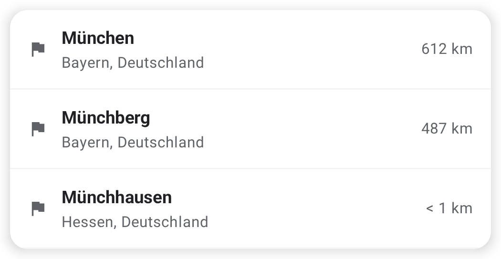
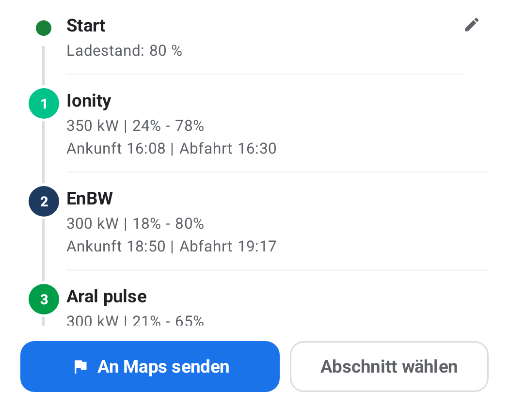
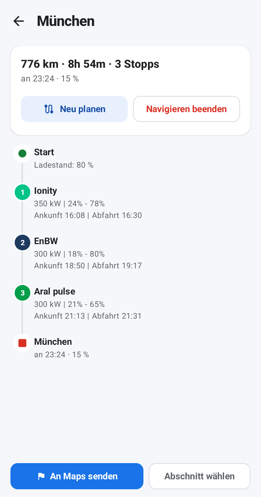

<div align="center">

# ⚡ ChargeAhead

**Plan your EV road trip — charging stops included.**

Pick a destination, get the charging stops that fit your car and battery,
and drive it with Google Maps. Also on Android Auto and CarPlay.

[](https://github.com/kalinjul/ChargeAhead/actions/workflows/ci.yml)


</div>

<table align="center">
  <tr>
    <td valign="top" width="33%"></td>
    <td valign="top" width="33%"></td>
    <td valign="top" width="33%"></td>
  </tr>
  <tr>
    <td align="center"><sub><b>1 · Search a destination</b></sub></td>
    <td align="center"><sub><b>2 · Get the charging stops</b></sub></td>
    <td align="center"><sub><b>3 · Drive the active route</b></sub></td>
  </tr>
</table>

<p align="center"><sub>The pictures are the screenshot-test goldens, so they always match the current UI.</sub></p>

---

## What it does

| Feature | |
|---|---|
| 🔎 **Plan a trip** | Type a destination in the search bar; the route and its charging stops appear in a sheet over the map — arrival charge level, charge window and times per stop. |
| 🚗 **Your car, your numbers** | A garage of vehicle profiles (battery, consumption, connectors, DC peak power) and the current charge level. Without them, reachability stays open instead of being guessed. |
| 🧭 **Navigate with Google Maps** | Send the whole route, one section, or a single stop to Google Maps. The sent trip stays the active route until you end it, and can be re-planned on the way. |
| 🗺️ **Chargers on the map** | Charging stations around you with live availability and a filter for power, distance and charging networks. |
| ⚡ **Jetzt laden** | The three best chargers nearby. If none fit, the filter relaxes step by step: power → networks → distance. |
| 🖥️ **In the car** | Android Auto (CarPlay to follow) brings the planned route, destination search, charge now and the charge level onto the car's screen — using the car's own battery reading where the head unit provides one. |

The UI is German, on purpose — the app is built for the German market.

## Status

| Platform | State |
|---|---|
| **Android** | Everyday use: trip planning, Google Maps hand-off, map, charge now, garage, active route. |
| **Android Auto** | Run in the car (Pixel + DHU): route, destination search, charge now, charge level, hand-off to navigation. |
| **iOS** | Core screens on the shared ViewModels; the map is still a placeholder, no garage yet. |
| **CarPlay** | Code written, waiting on Apple's charging entitlement. Moving to the same screens as Android Auto ([#152](https://github.com/kalinjul/ChargeAhead/issues/152)). |

Milestones and open questions: **[ROADMAP.md](ROADMAP.md)**.

## How it's built

```
shared/      Kotlin Multiplatform — domain, planning, ViewModels, data layer
phone-ui/    Compose phone UI (Android library)
androidApp/  Android app: CarAppService (Android Auto) + MainActivity
ui-tests/    Robolectric behaviour tests + screenshot goldens
iosApp/      Swift: SwiftUI phone UI + CarPlay scene
```

Everything that computes lives once, in `shared`: route planning, reachability,
formatting and the screen state. Android and iOS only draw it — so the car
shows the same numbers as the phone, on both platforms. Charging sites, live status, networks,
routing and the destination search come from the ChargeAhead backend.

## Getting started

**Prerequisites:** JDK 17, an Android SDK with Platform 37,
and access to the ChargeAhead backend.

1. Put the SDK path and the backend into `local.properties` (git-ignored):

   ```properties
   sdk.dir=/path/to/Android/Sdk
   chargeAheadBaseUrl=https://YOUR_HOST
   chargeAheadToken=YOUR_TOKEN
   googleMapsApiKey=YOUR_MAPS_KEY
   ```

2. Add the Maven access for the backend's contract module to
   `~/.gradle/gradle.properties`:

   ```properties
   chargeahead.maven.user=…
   chargeahead.maven.password=…
   ```

3. Build and install:

   ```bash
   ./gradlew :androidApp:installDebug
   ```

Without backend address and token the app stops at startup; without a Maps
key it says so in place of the map. For iOS, the same values go into
`iosApp/Secrets.xcconfig` — see [iosApp/README.md](iosApp/README.md).

## Testing

```bash
./gradlew testAll
```

That runs the shared unit tests, the Robolectric UI tests and the screenshot
comparison. The backend mapping can additionally be checked against the real
service:

```bash
CHARGEAHEAD_LIVE=1 ./gradlew :shared:jvmTest --tests '*BackendChargeSiteLiveContractTest'
```

Android Auto only runs on real hardware; the Desktop Head Unit makes it
testable from a desk. Swift can only be syntax-checked on Linux
(`tools/check-swift.sh`).

## Documentation

| Document | Covers |
|---|---|
| [ARCHITECTURE.md](ARCHITECTURE.md) | Design, platform constraints, data sources |
| [ROADMAP.md](ROADMAP.md) | Milestones, planned UI, open points |
| [AGENTS.md](AGENTS.md) | Conventions and the shared contract |
| [docs/testing.md](docs/testing.md) | Test layers, screenshot goldens |
| [docs/android-auto-testen.md](docs/android-auto-testen.md) | The app in the Desktop Head Unit |
| [docs/ci-cd.md](docs/ci-cd.md) | CI, Play Store releases, secrets |
| [iosApp/README.md](iosApp/README.md) | What to do on a Mac |
