# Garage redesign — brainstorm and mockups

Status: built. The mockups below record how we got there; where they differ, this section wins.

## As built

- **Garage:** the cars as an endless stack of cards. Swiping picks the car; the next card lies
  behind, its end showing, and a card swiped past fades out to the left. No pills, no dots.
  "+ Auto hinzufügen" floats centred at the bottom. Rows: "Fahrzeug anpassen", "Ladestand am Ziel"
  (bottom sheet with slider and quick picks).
- **Fahrzeug anpassen:** the catalog model (or "Eigenes Fahrzeug") on its own card, then name,
  consumption, battery and max. charging power, each typed in a dialog with the catalog's value
  under the field. "Katalogwerte übernehmen" is always there, enabled when battery, power or
  consumption differ from the catalog; the name never counts and survives catalog updates.
  Removal asks first.
- **Own cars** start from the add-car search ("„…“ selbst anlegen").
- **Trip and active route** pick their charge levels in the same sheet as the garage.
- Dropped on the way: the WLTP notch with haptics, the consumption slider, the tilt.
- The card shadow is drawn (`dropShadow`, outside the outline only) in one `ModulateAlpha` layer:
  elevation shadows break on fading cards.

The mockup previews were never merged; their renders are in `docs/mockups/garage/`.

## Decisions after the first review

- **A** it is. Adding cars goes through the chip row in every case ("+ Auto"
  next to the car chips, also with a single car); no "add" row at the bottom.
- The car card is a tonal `primaryContainer` surface: name, range, two stats
  (battery, DC peak). No icon, no "aus dem Katalog", no connector: where a car
  came from does not matter on this page.
- No ⋮ menu. Its only real item would have been "remove", and a one-item menu is
  a smell; removing lives at the bottom of "Fahrzeugdaten", the only place.
- "Fahrzeugdaten" has no connector choice: CCS and Typ 2 are a given in Europe.
  It shows the catalog note and "Katalogwerte übernehmen" from #176 once the
  driver changed a catalog car's values.
- The consumption slider clicks into the WLTP value: `DetentSlider`
  (`phone-ui/.../components/DetentSlider.kt`) wraps the native slider, pulls the
  thumb onto the detent within 2 % of the range and fires one
  `HapticFeedbackType.SegmentTick`. Material's `Slider` only knows evenly spaced
  `steps`, so a single notch at 15,9 is not available out of the box.
- Edits stay in bottom sheets with sliders: they read as "set once, rarely
  touched".

## What is wrong today

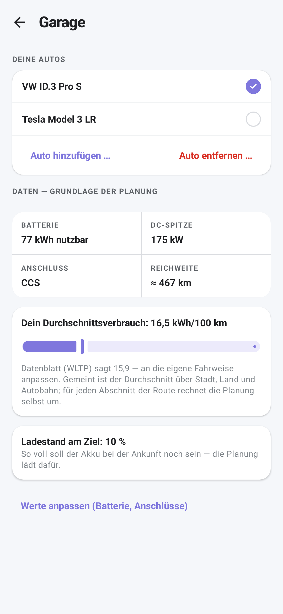

- **Everything weighs the same.** Car list, add/remove links, a four-cell grid,
  two cards with paragraphs, a link out: eight blocks, one visual level.
- **The selected car has no identity.** It is a ticked row; its data sits two
  blocks further down under "Daten — Grundlage der Planung".
- **Removing is a mode.** "Auto entfernen …" turns the ticks into delete
  buttons until "Fertig". And the edit screen has a second delete button.
- **Two settings, two interaction models.** Consumption is an inline slider
  under a three-line paragraph; the arrival level is a card that opens a dialog.
- **The arrival level is global but looks per-car.** `arrivalSocPercent` is one
  value for the whole garage, yet it sits inside the selected car's panel.
- **The edit screen is a form dump.** Raw text fields, a read-only charge level,
  and the car-hardware diagnostics, which belong to the debug page.

## Principles for every direction

- One subject per screen: the car you plan with.
- Settings are Material `ListItem` rows showing their value; editing happens in
  a bottom sheet, the same way for both settings. The explanations move into
  the sheets.
- Native parts only: `ElevatedCard` (our `AppCard`), `ListItem`, `FilterChip`,
  `ModalBottomSheet`, `Slider`, carousel. No new custom components.
- One place to delete a car: the car's own edit page (and its overflow menu).
- Charge level and car diagnostics leave the garage; they live in Debug.

## A — Hero + settings (recommended)

| One car | Two cars | Dark |
|---|---|---|
| 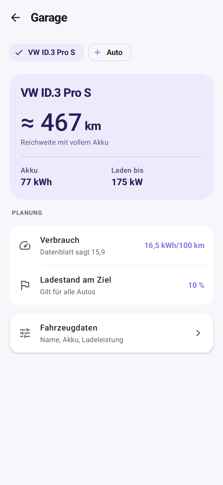 | 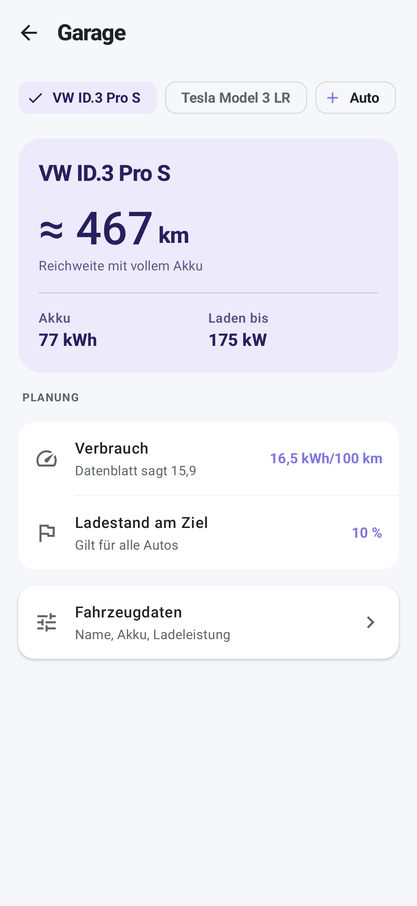 | 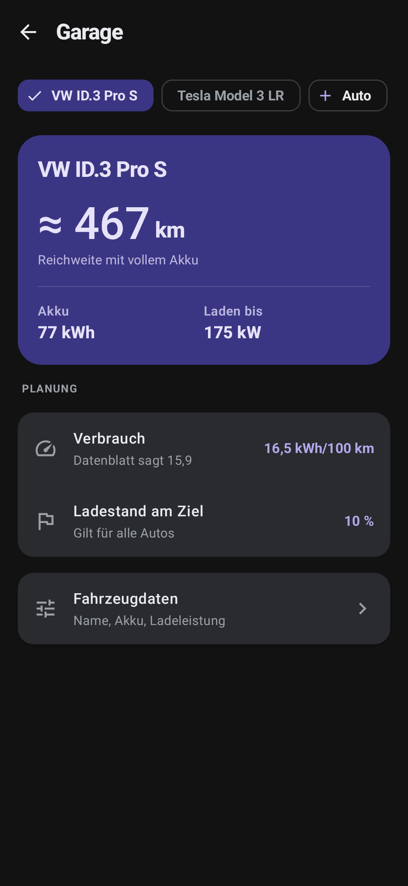 |

- The selected car is a tonal hero card: name, range with a full battery in
  large type, then battery and DC peak as two quiet stats.
- A row of `FilterChip`s above the hero switches the active car, an assist chip
  "+ Auto" adds one, with one car as with several.
- "Planung": consumption and arrival level as two rows with their values in
  primary. "Gilt für alle Autos" says out loud what today is hidden.

| Consumption sheet | Arrival sheet | No car yet | Vehicle data |
|---|---|---|---|
| 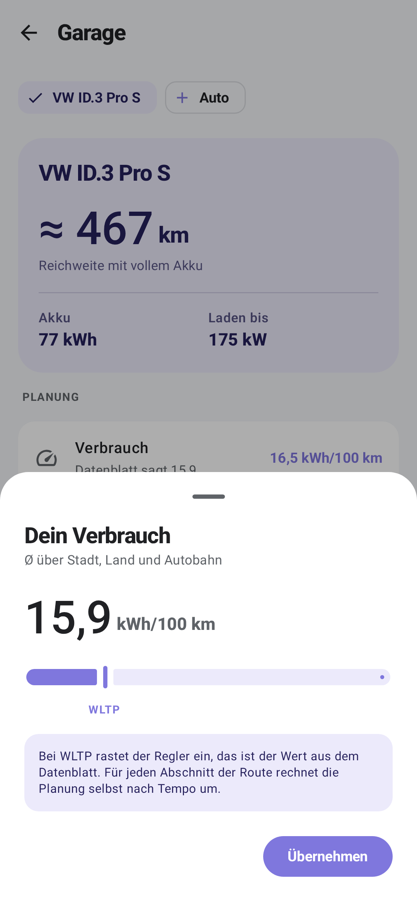 | 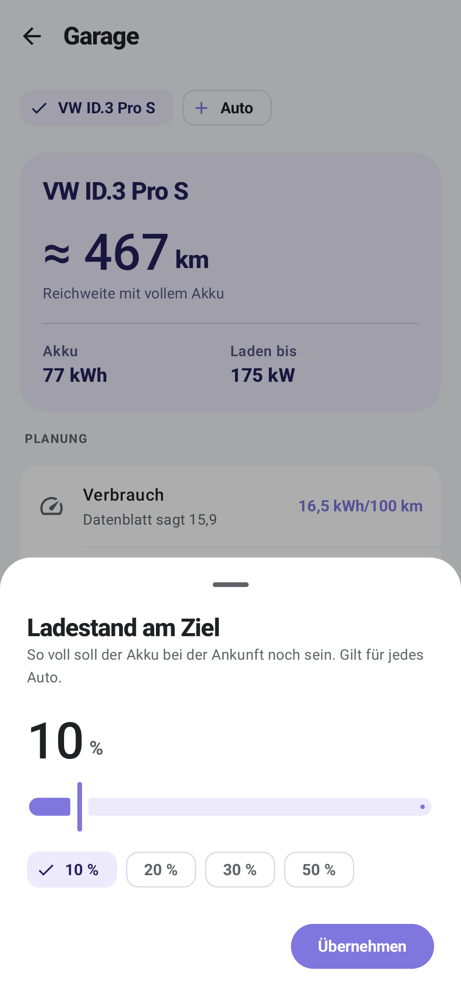 | 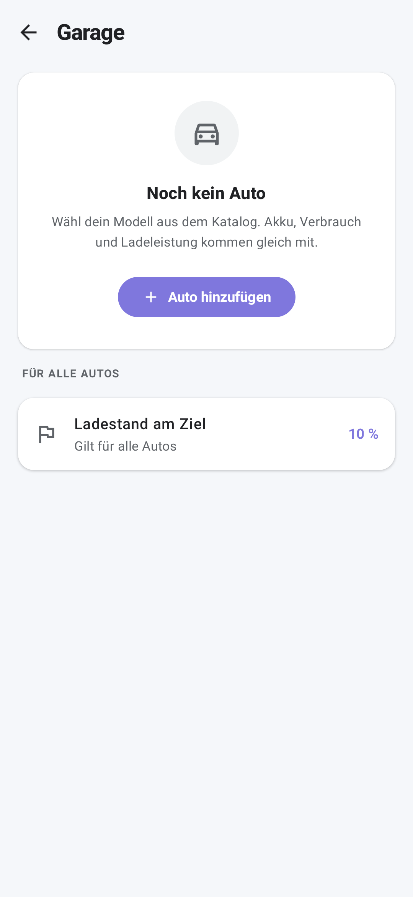 | 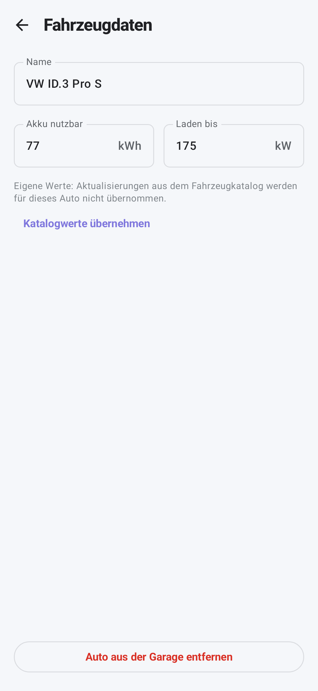 |

- **Consumption sheet:** the value large, slider 12–30 that clicks into the WLTP
  value (marked under the track), one sentence on what the value means.
- **Arrival sheet:** value, slider 0–80, quick chips 10/20/30/50 %. Replaces the
  dialog with the number field; typing a percentage was never needed.
- **Empty state:** one card with one button. The arrival level stays reachable,
  since it does not need a car.
- **Vehicle data:** name, usable battery and DC peak side by side with units as
  suffixes, the catalog note with "Katalogwerte übernehmen" when values were
  changed, delete at the bottom in red. Consumption has its own sheet.

## B — Carousel

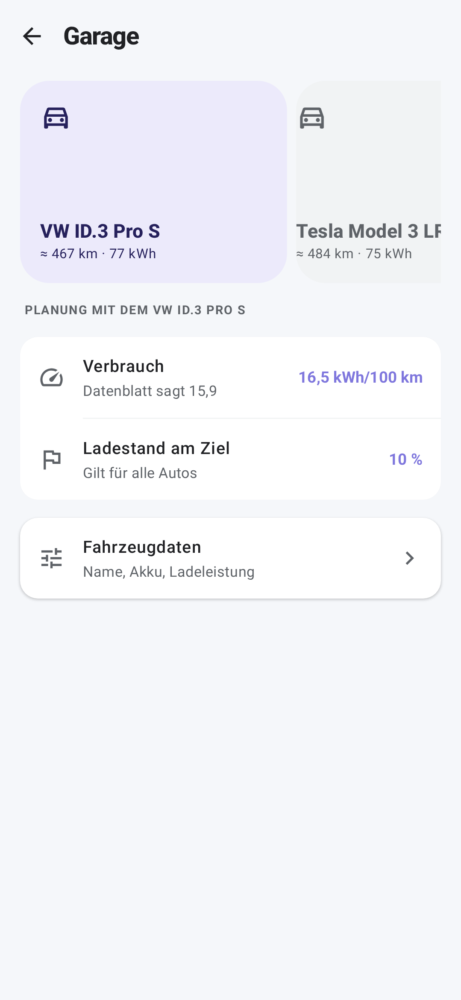

Material's `HorizontalUncontainedCarousel` with one card per car and a "+" card
at the end; the settings below follow the car in front.

- Pro: the most "garage"-like, cars as objects you flick through.
- Con: with one car (the common case) a carousel is a single lonely card;
  selection by scrolling is ambiguous (is the car in front the active one, or
  just looked at?). Without car pictures the cards are mostly empty colour.

## C — List → detail

| List | Detail |
|---|---|
| 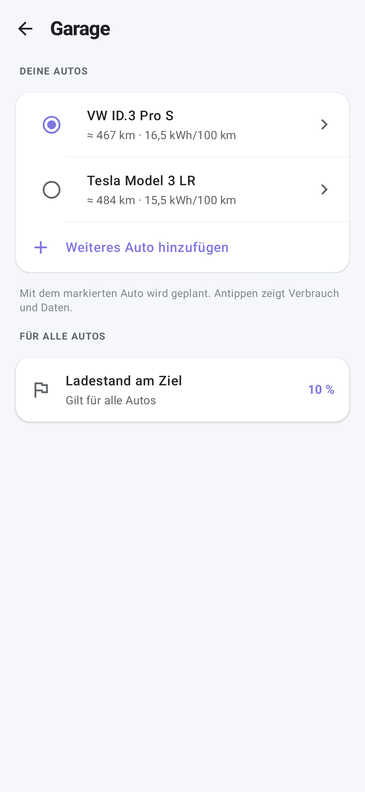 | 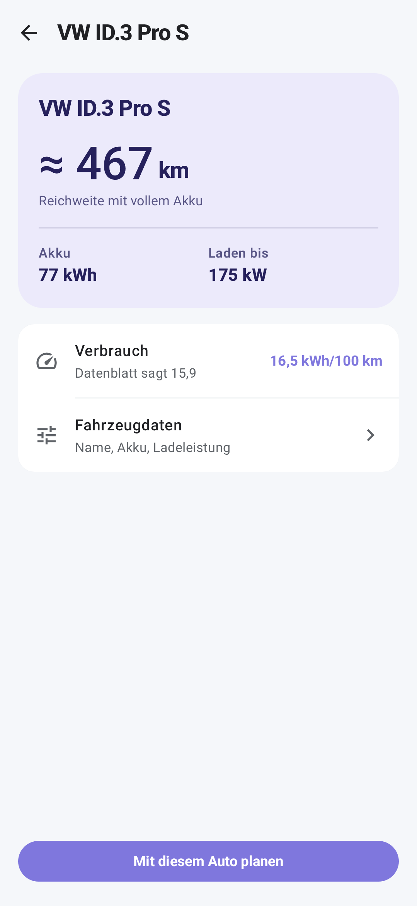 |

The garage is a plain list (radio = active car, chevron = details); each car
gets a detail page with the hero from A.

- Pro: scales to many cars, the clearest model for "which car is active".
- Con: one extra tap for the thing people actually adjust (consumption), and the
  garage page itself becomes almost empty with one car.

## Recommendation

A. It is the only one that looks complete with a single car, keeps every edit
one tap away, and reuses the same sheet pattern twice. B is worth it only once
there are car images; C only if people start keeping five cars.

## Open questions for Raphael

1. Should the arrival level move out of the garage entirely, into the drawer
   next to "Mindestleistung"? It is a planning preference, not a car property.
2. Hero range: "mit vollem Akku" (0–100 %) as today, or what is usable after the
   reserve and the arrival level? The second is more honest, but changes with a
   setting on the same page.

## Found on the way

`AppCard` in the dark theme draws its text grey (visible in the list cards of the dark mockup): its
container `surfaceContainerHigh` equals `surfaceVariant` (`#2A2B2F`), so
`contentColorFor` picks `onSurfaceVariant`. Same in the app today. Fix: give
`AppCard` an explicit `contentColor = onSurface`, or nudge one of the two greys.

## If A is picked

- `GarageScreen` rebuilt from hero + rows; `AppCard`, `ListItem`, `FilterChip`.
- Two `ModalBottomSheet`s; the arrival dialog (`SocEditDialog` use in the
  garage) goes. `GarageViewModel` keeps its state, the sheet open/close joins it.
- `VehicleSettingsScreen` slimmed to the A6 page; SoC field and
  `CarHardwareStatus` move to the debug page.
- Remove mode, `TickRow` delete style for the garage, and the long strings go.
